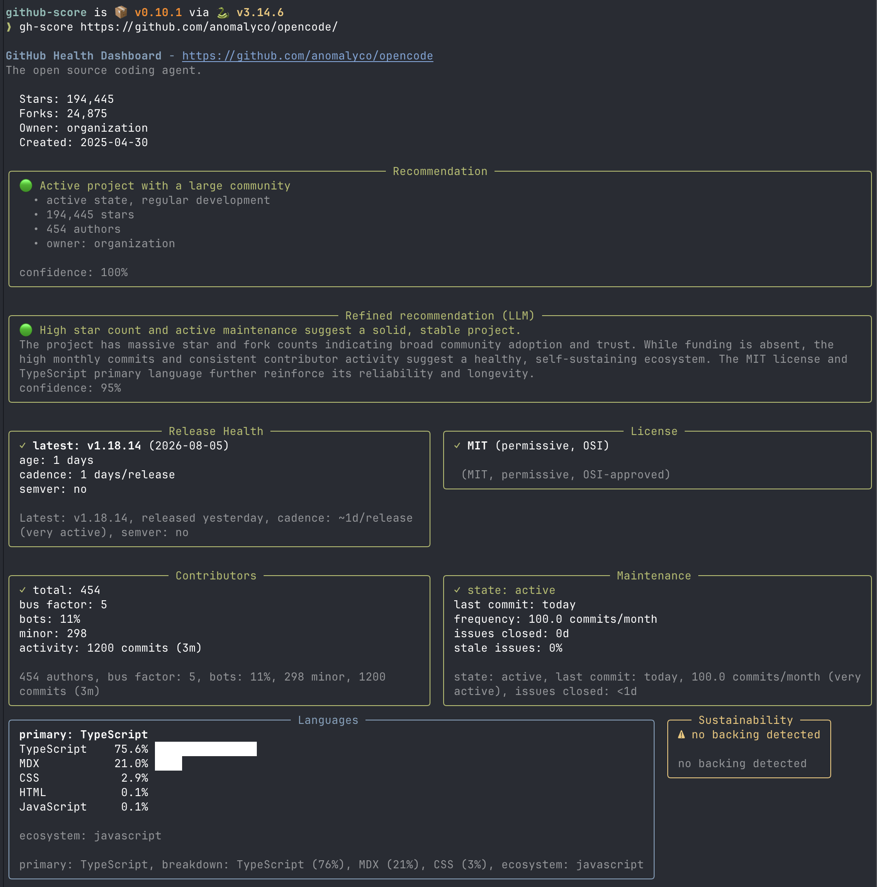

# gh-score

GitHub Project Health Scorer — evaluate maturity, maintenance, community health and sustainability of any GitHub project, in your terminal.

`gh-score` turns raw GitHub signals (commit activity, contributors, releases, license, registries, sustainability) into a single **traffic-light verdict**: 🟢 green (safe to bet on), 🟠 orange (proceed with caution), 🔴 red (risky).

When a repository declares a homepage, `gh-score` also checks that the
application's web page is actually reachable — DNS resolution, timeouts,
HTTP status (redirects followed) — and flags pages hidden behind a
bot-protection check ("I'm not a robot"). A dead homepage is a red flag
for the verdict.

## Usage

```bash
# Analyze a remote repository (no install needed)
uvx gh-score https://github.com/owner/repo

# Analyze the current directory (if it's a git clone)
uvx gh-score

# Or install it
pip install gh-score
gh-score https://github.com/owner/repo
```

### Output formats

```bash
gh-score --format tui       https://github.com/owner/repo   # terminal dashboard (default)
gh-score --format markdown  https://github.com/owner/repo   # Markdown report
gh-score --format json      https://github.com/owner/repo   # structured JSON
```

### Compare projects

Pass two or more URLs to compare them side by side — e.g. to pick
between similar libraries:

```bash
gh-score https://github.com/fastapi/fastapi https://github.com/pallets/flask https://github.com/django/django
gh-score --format markdown https://github.com/BurntSushi/ripgrep https://github.com/sharkdp/fd
```

The comparison checks that it is **credible**: each pair is assessed for
subject comparability (shared topics / description keywords), language
compatibility for libraries, and library-vs-application mismatches.
Non-credible pairs are flagged with the reason — warnings never block
the comparison.

The output is a **decision table**: one line per project (stars,
license, language, maintenance state, last commit, bus factor,
downloads, latest release, traffic-light verdict), ranked by verdict,
then downloads, then bus factor. Each pair also shows an informational
similarity score (0.0–1.0) saying how close the expressed subjects are.

### Optional LLM analysis

The LLM is opt-in and never required. It extracts qualitative facts that
cannot be derived from APIs or files (roadmap, commercial support,
security policy, self-declared maintenance state) and produces a refined,
complementary recommendation that weighs all indicators together.

```bash
export GH_SCORE_LLM_ENABLED=true
export GH_SCORE_LLM_BASE_URL="https://api.openai.com/v1"   # any OpenAI-compatible API
export GH_SCORE_LLM_MODEL="gpt-4o-mini"
export GH_SCORE_LLM_API_KEY="sk-..."
gh-score https://github.com/owner/repo
```

**Reasoning models** (Qwen-style "thinking", DeepSeek R1, …) spend the
whole token budget on chain-of-thought and get cut off before emitting
the JSON. If your model produces "empty or unparseable JSON response"
warnings, disable the reasoning pass:

```bash
export GH_SCORE_LLM_DISABLE_REASONING=true
```

The provider then asks the server to skip reasoning
(`chat_template_kwargs.enable_thinking: false`, honored by oMLX / vLLM /
llama.cpp-style servers, plus the OpenAI-compatible
`reasoning_effort: "none"`). Opt-in: only set it for reasoning models.

### Configuration

Set a `GITHUB_TOKEN` to raise API rate limits. LLM settings can also live
in a `config.toml` (see `gh-score config`). Everything stays optional:
the tool works fully offline with local clones and no token.

`gh-score` never loads a `.env` file tacitly. If you keep your settings
in one (like the example below), load it explicitly with `--env`:

```bash
cat > .env <<'EOF'
GITHUB_TOKEN="..."
GH_SCORE_LLM_ENABLED=true
GH_SCORE_LLM_BASE_URL="http://127.0.0.1:8008/v1"
GH_SCORE_LLM_MODEL="Qwen3.5-2B-6bit"
EOF

gh-score analyze --env .env https://github.com/owner/repo
```

The `.env` parser is deliberately small: `KEY=VALUE` lines, an `export`
prefix is accepted, values may be single/double-quoted, `#` starts a
comment. An already-exported variable always wins over the file.

To enrich the report with **dependents counts** (how many packages depend
on this library) for PyPI, npm and Maven — the only ecosystems whose
official registries expose no reverse-dependency count — set a free
[libraries.io](https://libraries.io/api) API key (60 requests/minute):

```bash
export LIBRARIES_IO_API_KEY="..."
# or in config.toml:
# [registries]
# libraries_io_api_key = "..."
```

crates.io, RubyGems and Go (pkg.go.dev) always provide their own dependents
count; downloads are always fetched where the registry exposes them.

## Library

```python
from gh_score import analyze_repo

result = analyze_repo("https://github.com/owner/repo")
print(result.recommendation.level)          # RecommendationLevel.GREEN
print(result.release_health.latest_version) # "v1.0.0"
print(result.contributors.bus_factor)       # 3
```

## Screenshot



## License

GPL-3.0 — see [LICENSE](LICENSE).
